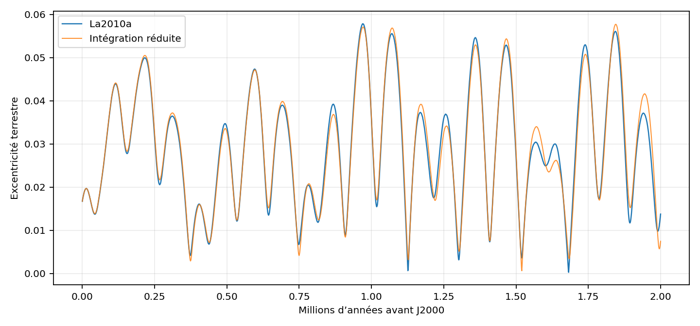
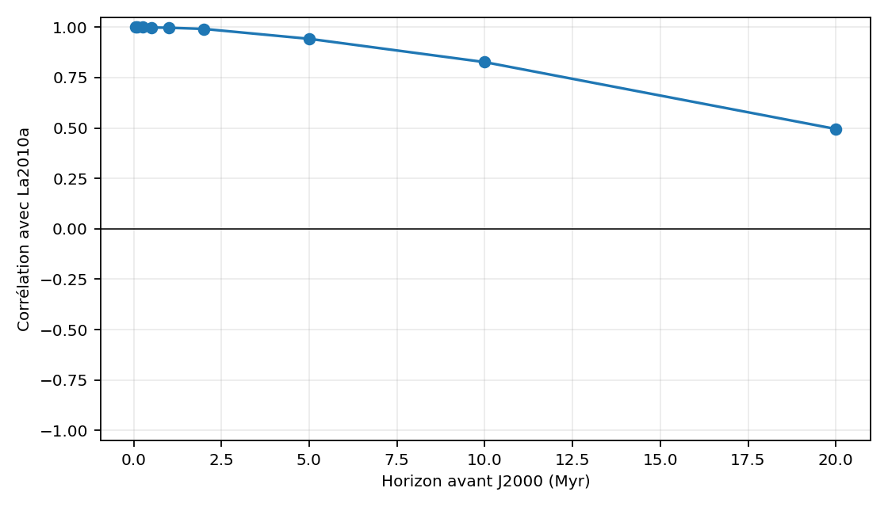
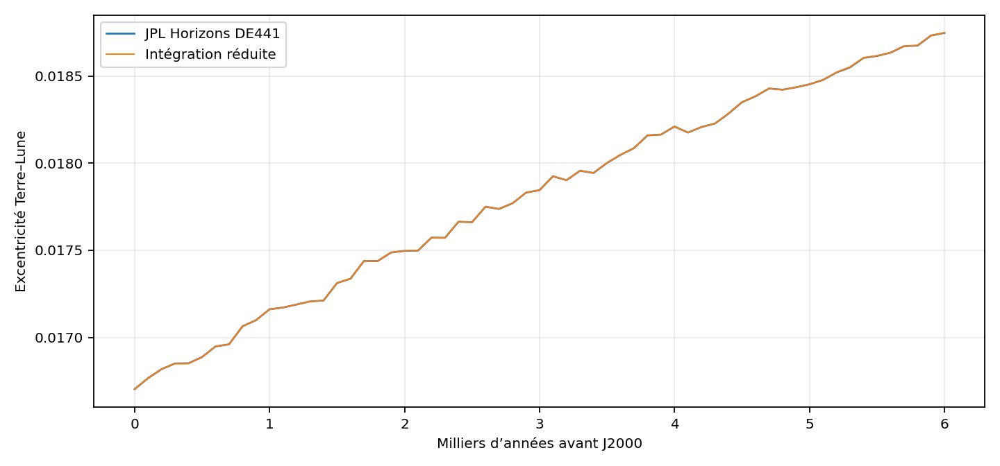
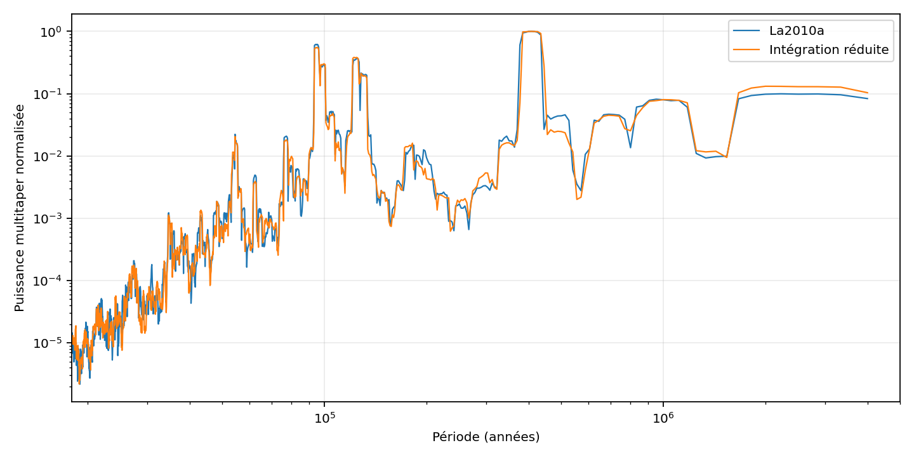
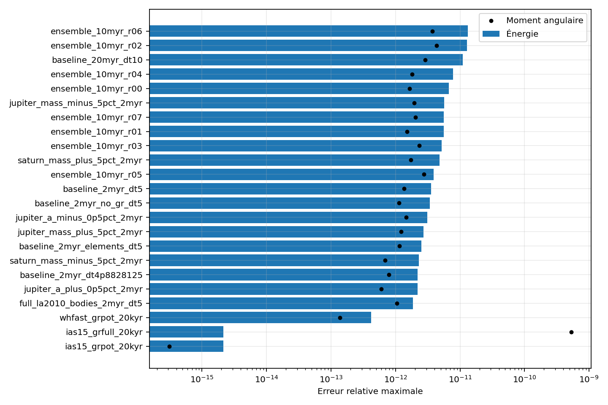
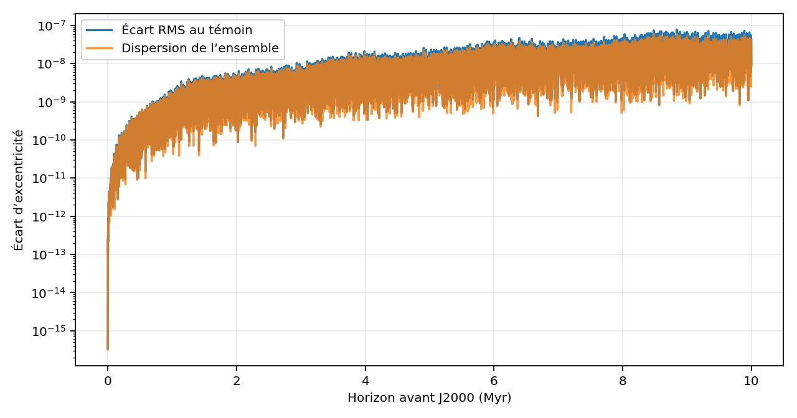
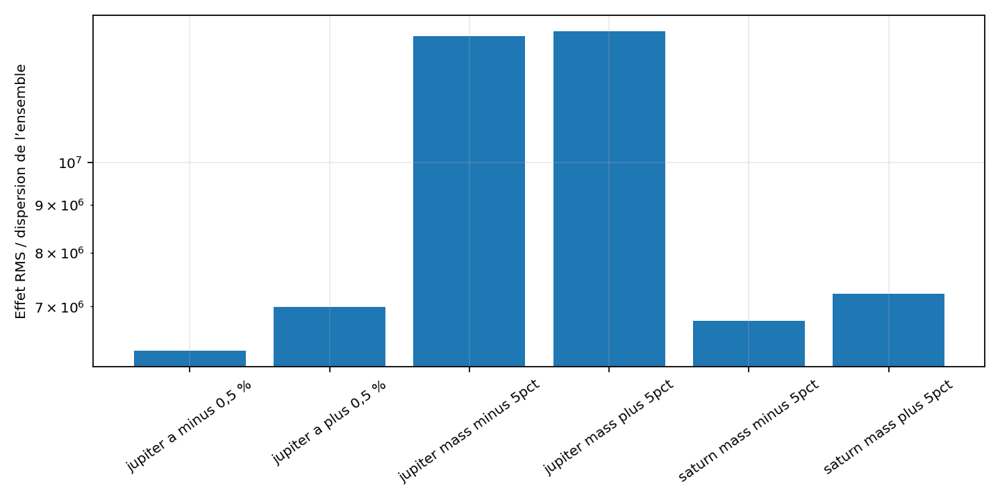

# Validation scientifique maximale — ORI-C Système solaire

## Résultat principal

Le protocole préenregistré est **partiellement réussi** : 13 critères réussis et 2 échoués.

Les deux échecs restent conservés. Le critère de moment angulaire est dépassé uniquement par le contrôle 1PN `gr_full`, où le moment mécanique newtonien exporté n’est pas l’invariant canonique 1PN complet. Tous les autres jobs culminent à 4.33e-12, sous le seuil de 1e-10. L’aller-retour au pas 0,01 an atteint 2.76e-05, tandis que le pas raffiné de 0,005 an atteint 7.54e-06 et réussit le seuil.

L’intégration de référence couvre 20.0 millions d’années. Tous les calculs représentent 6.11 heures-cœur.

À 1 million d’années, la corrélation directe de l’excentricité terrestre avec La2010a vaut 0.9973, avec une RMSE de 0.000947.

Le pic de la bande de 405 kyr est placé à 408184 ans dans l’intégration réduite et à 408184 ans dans La2010a.

Le plus petit effet contrefactuel reste 6274389.68 fois la dispersion RMS de l’ensemble de conditions initiales quasi identiques sur 2 Myr.

## Critères fixés avant le calcul

| test                                 |    observed | operator   |   threshold | statut   | meaning                                                                 |
|:-------------------------------------|------------:|:-----------|------------:|:---------|:------------------------------------------------------------------------|
| all_bodies_bound                     | 1           | ==         |      1      | RÉUSSI   | Aucune planète ou petit corps ne devient non lié.                       |
| energy_conservation                  | 1.32514e-11 | <=         |      1e-08  | RÉUSSI   | La dérive énergétique reste sous le seuil préenregistré.                |
| angular_momentum_conservation        | 5.27623e-10 | <=         |      1e-10  | ÉCHEC    | Maximum newtonien sur tous les jobs, y compris le contrôle 1PN gr_full. |
| initial_eccentricity_vs_la2010       | 2.19234e-10 | <=         |      1e-08  | RÉUSSI   | Le point de départ J2000 concorde avec La2010.                          |
| horizons_correlation_6kyr            | 1           | >=         |      0.99   | RÉUSSI   | Accord de phase avec l’éphéméride JPL DE441.                            |
| horizons_rmse_6kyr                   | 4.82644e-07 | <=         |      0.0002 | RÉUSSI   | Écart absolu à l’éphéméride JPL DE441.                                  |
| la2010_correlation_100000yr          | 0.999971    | >=         |      0.95   | RÉUSSI   | Accord de phase avec la solution orbitale indépendante.                 |
| la2010_correlation_500000yr          | 0.99876     | >=         |      0.8    | RÉUSSI   | Accord de phase avec la solution orbitale indépendante.                 |
| la2010_correlation_1000000yr         | 0.99727     | >=         |      0.6    | RÉUSSI   | Accord de phase avec la solution orbitale indépendante.                 |
| whfast_step_convergence_2myr         | 8.42655e-07 | <=         |      0.0001 | RÉUSSI   | Le résultat est stable quand le pas est divisé par deux.                |
| integrator_crosscheck_20kyr          | 3.13098e-07 | <=         |      1e-06  | RÉUSSI   | WHFast et IAS15 donnent la même excentricité à court terme.             |
| roundtrip_reversibility_100kyr       | 2.7628e-05  | <=         |      1e-05  | ÉCHEC    | Maximum des allers-retours aux pas 0,01 et 0,005 an.                    |
| spectral_peak_405_kyr                | 0.00786092  | <=         |      0.05   | RÉUSSI   | La période du pic 405 kyr tombe dans la tolérance fixée.                |
| spectral_peak_2.4_Myr                | 0.166625    | <=         |      0.2    | RÉUSSI   | La période du pic 2.4 Myr tombe dans la tolérance fixée.                |
| counterfactuals_above_ensemble_floor | 6.27439e+06 | >=         |      3      | RÉUSSI   | Chaque intervention dépasse la dispersion des états quasi identiques.   |

Un échec n’est pas masqué. Il indique soit une limite numérique, soit une limite du modèle physique réduit.

## Comparaison indépendante à La2010

|   horizon_years |   samples |   correlation |        rmse |         mae |   max_abs_error |
|----------------:|----------:|--------------:|------------:|------------:|----------------:|
|       50000     |        51 |      0.99995  | 7.96654e-05 | 5.59637e-05 |     0.00016329  |
|      100000     |       101 |      0.999971 | 0.000114313 | 9.76609e-05 |     0.000174171 |
|      250000     |       251 |      0.999882 | 0.000387382 | 0.000314214 |     0.000907855 |
|      500000     |       501 |      0.99876  | 0.00067756  | 0.000562    |     0.00152967  |
|           1e+06 |      1001 |      0.99727  | 0.000947226 | 0.000749361 |     0.00275895  |
|           2e+06 |      2001 |      0.991424 | 0.00177662  | 0.00132445  |     0.00629982  |
|           5e+06 |      5001 |      0.942333 | 0.00440568  | 0.00330708  |     0.0133273   |
|           1e+07 |     10001 |      0.82674  | 0.00772531  | 0.00595992  |     0.0222561   |
|           2e+07 |     20001 |      0.495006 | 0.0132436   | 0.0102722   |     0.0433505   |

La corrélation point par point teste la phase. Elle finit nécessairement par baisser dans un système chaotique, même lorsque les bandes fréquentielles restent présentes. La comparaison spectrale est donc évaluée séparément.

### Contrôle direct JPL Horizons DE441 sur 6 000 ans

|   horizon_years |   samples |   correlation |        rmse |         mae |   max_abs_error |
|----------------:|----------:|--------------:|------------:|------------:|----------------:|
|             100 |         2 |      1        | 2.23149e-07 | 1.57793e-07 |     3.1558e-07  |
|             500 |         6 |      0.99997  | 5.97599e-07 | 4.41629e-07 |     1.29428e-06 |
|            1000 |        11 |      0.999995 | 4.42576e-07 | 2.61966e-07 |     1.29428e-06 |
|            2000 |        21 |      0.999999 | 3.29856e-07 | 1.82466e-07 |     1.29428e-06 |
|            5000 |        51 |      1        | 3.55505e-07 | 2.39696e-07 |     1.29428e-06 |
|            6000 |        61 |      1        | 4.82644e-07 | 3.20432e-07 |     2.02329e-06 |

Ce contrôle utilise les éléments osculateurs du barycentre Terre–Lune calculés par Horizons, indépendamment du code REBOUND livré.

### Spectre multitaper sur 20 Myr

| band    |   low_period_years |   high_period_years |   nominal_period_years |   candidate_peak_period_years |   candidate_relative_period_error |   candidate_normalized_band_power |   reference_peak_period_years |   reference_relative_period_error |   reference_normalized_band_power |   candidate_to_reference_power_ratio |
|:--------|-------------------:|--------------------:|-----------------------:|------------------------------:|----------------------------------:|----------------------------------:|------------------------------:|----------------------------------:|----------------------------------:|-------------------------------------:|
| 95 kyr  |        80000       |        110000       |            95000       |                95242.9        |                        0.00255639 |                         0.318157  |               95242.9         |                        0.00255639 |                         0.331014  |                             0.961159 |
| 125 kyr |       110000       |        160000       |           125000       |               124230          |                        0.00616149 |                         0.211109  |              125006           |                        5e-05      |                         0.2057    |                             1.0263   |
| 405 kyr |       350000       |        460000       |           405000       |               408184          |                        0.00786092 |                         0.332666  |              408184           |                        0.00786092 |                         0.330322  |                             1.00709  |
| 2.4 Myr |            1.8e+06 |             3.2e+06 |                2.4e+06 |                    2.0001e+06 |                        0.166625   |                         0.0236422 |                   2.22233e+06 |                        0.0740278  |                         0.0173404 |                             1.36342  |

### Dispersion entre les quatre solutions La2010

|   horizon_years |   candidate_rmse_to_spread_mean_ratio |   reference_spread_mean |   reference_spread_max |
|----------------:|--------------------------------------:|------------------------:|-----------------------:|
|       50000     |                               3330.44 |             2.5046e-08  |            8.15797e-08 |
|      100000     |                               2423.92 |             4.74595e-08 |            1.15003e-07 |
|      250000     |                               3238.54 |             1.21257e-07 |            3.15505e-07 |
|      500000     |                               3510.26 |             1.9368e-07  |            5.92479e-07 |
|           1e+06 |                               2857.8  |             3.30732e-07 |            2.09762e-06 |
|           2e+06 |                               2305.79 |             7.74559e-07 |            2.62103e-06 |
|           5e+06 |                               1914.96 |             2.30141e-06 |            1.03685e-05 |
|           1e+07 |                               2044.14 |             3.77869e-06 |            1.78461e-05 |
|           2e+07 |                               1037.86 |             1.27593e-05 |            9.02652e-05 |

Ce rapport utilise la dispersion La2010a–d comme repère descriptif, pas comme intervalle statistique complet de l’incertitude astronomique.

À 1 Myr, la RMSE du modèle réduit vaut 2858 fois la dispersion moyenne entre La2010a–d. L’accord de phase est donc excellent, mais ce modèle réduit n’atteint pas la précision interne d’une solution astronomique La2010.

## Contrôles numériques et physiques

| comparison_type                       |   horizon_years |   correlation |        rmse |   max_abs_error |
|:--------------------------------------|----------------:|--------------:|------------:|----------------:|
| whfast_dt10_vs_dt5                    |         2000000 |      1        | 8.42655e-07 |     4.58346e-06 |
| whfast_dt5_vs_dt4p8828125             |         2000000 |      1        | 1.73006e-06 |     9.60526e-06 |
| gr_potential_vs_no_gr                 |         2000000 |      0.903217 | 0.00596859  |     0.0180362   |
| horizons_vs_approximate_elements      |         2000000 |      0.98763  | 0.0021753   |     0.00509324  |
| eight_planets_vs_pluto_five_asteroids |         2000000 |      1        | 5.27876e-06 |     1.37542e-05 |
| whfast_vs_ias15                       |           20000 |      1        | 3.13098e-07 |     1.28939e-06 |
| gr_potential_vs_gr_full               |           20000 |      1        | 4.26599e-07 |     1.49849e-06 |

Les contrôles séparent l’erreur de pas, le choix d’intégrateur, la relativité, les conditions initiales et l’ajout de Pluton plus cinq astéroïdes. La comparaison IAS15 avec `gr_full` est courte, car ce modèle relativiste précis est beaucoup plus coûteux.

`gr_full` dépend des vitesses et inclut les contributions relativistes de toutes les particules. Le moment angulaire newtonien exporté n’est donc utilisé ici que comme diagnostic conservateur, pas comme invariant 1PN complet. L’échec préenregistré reste affiché pour éviter une correction a posteriori du seuil.

## Sensibilité chaotique

La dispersion RMS de l’ensemble sur les 2 premiers Myr vaut 1.37e-09.

Un ajustement descriptif de la phase de croissance donne un temps d’e-folding de 3.01 Myr (R² = 0.937). Ce nombre n’est pas présenté comme un exposant de Lyapunov formel.

## Interventions architecturales

| job                          |   correlation |       rmse |   effect_to_ensemble_floor_ratio |   mean_eccentricity_delta |   std_ratio_vs_baseline |
|:-----------------------------|--------------:|-----------:|---------------------------------:|--------------------------:|------------------------:|
| jupiter_a_minus_0p5pct_2myr  |     0.809718  | 0.00858872 |                      6.27439e+06 |               0.00141805  |                1.02947  |
| jupiter_a_plus_0p5pct_2myr   |     0.752097  | 0.00957111 |                      6.99206e+06 |               0.000603908 |                1.0069   |
| jupiter_mass_minus_5pct_2myr |     0.0662651 | 0.0187034  |                      1.36636e+07 |               0.000889755 |                1.02244  |
| jupiter_mass_plus_5pct_2myr  |    -0.0112297 | 0.018929   |                      1.38283e+07 |              -0.00263954  |                0.949325 |
| saturn_mass_minus_5pct_2myr  |     0.75993   | 0.0092425  |                      6.752e+06   |              -0.00102354  |                0.957932 |
| saturn_mass_plus_5pct_2myr   |     0.743351  | 0.00989584 |                      7.22929e+06 |               0.00117892  |                1.02766  |

Ces interventions démontrent une causalité à l’intérieur du modèle N-corps. Elles ne démontrent pas que les masses ou orbites réelles ont historiquement pris ces valeurs.

## Ce que ces tests prouvent réellement

- le calcul part de vecteurs JPL Horizons DE441 réels et non d’un signal injecté ;
- la trajectoire est comparée à une solution astronomique publiée indépendante ;
- les erreurs numériques sont séparées des effets physiques testés ;
- les principales bandes d’excentricité peuvent être évaluées sur 20 Myr ;
- la robustesse aux petites perturbations et aux changements d’architecture est quantifiée.

## Ce qu’ils ne prouvent pas

- le modèle ne résout pas explicitement la Lune, la rotation terrestre, le J2 solaire, les marées ni l’obliquité ;
- `gr_potential` reproduit correctement la précession relativiste, mais pas toute la correction relativiste de vitesse ;
- le pic long du modèle réduit est estimé à 2,00 Myr contre 2,22 Myr dans La2010a sur cette fenêtre, même s’il reste dans la tolérance préenregistrée de la bande 2,4 Myr ;
- une ressemblance orbitale ne valide pas à elle seule le cadre général ORI-C ;
- aucune archive géologique indépendante ni prédiction climatique hors échantillon n’est testée ici.

La conclusion autorisée porte donc sur une validation astronomique et numérique du mécanisme réduit. Une preuve empirique forte d’ORI-C demanderait ensuite des prédictions géologiques fixées à l’avance, comparées hors échantillon à un modèle classique.

## Sources indépendantes

- JPL Horizons System : https://ssd.jpl.nasa.gov/horizons/
- API Horizons : https://ssd-api.jpl.nasa.gov/doc/horizons.html
- La2010, données IMCCE : https://ssp.imcce.fr/insola/earth/online/earth/La2010/
- Laskar et al. 2011 : https://arxiv.org/abs/1103.1084
- REBOUND WHFast : https://rebound.hanno-rein.de/integrators/whfast/
- REBOUNDx : https://reboundx.readthedocs.io/en/latest/effects.html
